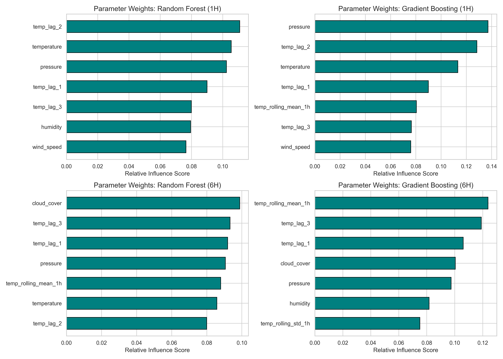
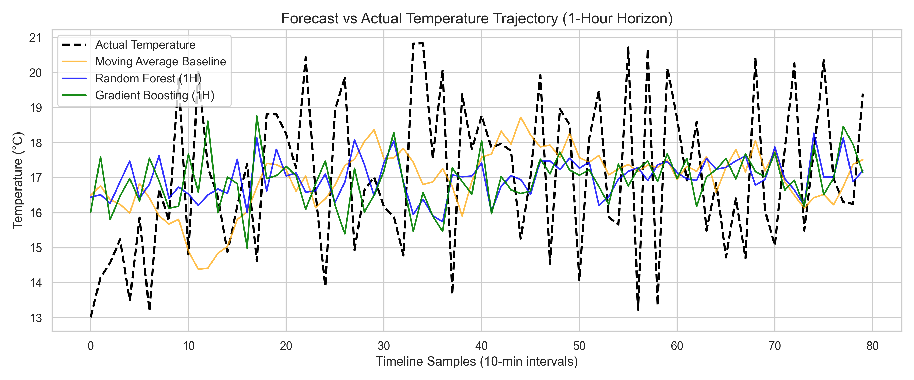
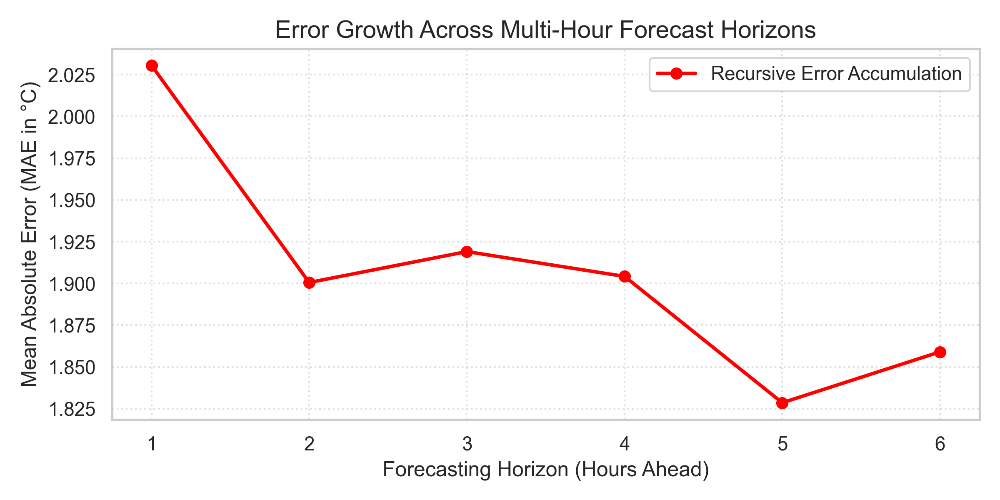

# Gdansk Weather Forecasting Pipeline

## Introduction

The goal of this project is to build a simple forecasting model that predicts future
temperature values based on historical weather measurements.

I did collect a dataset from the API, prepare features, train a model, and evaluate
prediction quality.

## 1. Choosing Our Tools: Why We Picked What We Used

When building this project, we were given a long list of possible tools. We carefully selected our stack to keep things efficient, cost-effective, and powerful without adding unnecessary complexity.
Storage Choices: Data Lake Structure on AWS S3

* What we rejected: Keeping files as local CSV/JSON files is risky because if your computer crashes, the data is gone. Relational Databases (like SQL) or DynamoDB are great for looking up single customer records, but they are expensive and clumsy for storing continuous rows of sensor data.

* What we chose: We built a Data Lake Structure on AWS S3. S3 is like an infinite, secure hard drive in the cloud. A "Data Lake" simply means we organize our files into folders based on how clean the data is: Bronze for raw API data, Silver for cleaned data tables, and Gold for our finished AI models.

Analytical Choices: Python, Pandas, and Scikit-Learn

* What we rejected: Tools like PySpark, AWS Glue, and Athena are designed for massive corporate data (millions of rows). Because our data size was small, using them would be like driving a giant semi-truck to the grocery store. QuickSight and SageMaker are powerful but require expensive corporate licenses.

* What we chose: 
  * Jupyter Notebooks / Python: Our friendly workbench for writing and testing code safely.

  * Pandas: The ultimate library for turning messy text into clean data grids (like Excel spreadsheets inside Python).

  * Scikit-Learn: A simple, reliable library that has all the standard machine learning formulas built-in and ready to use.

## 2. Changing my Goal: The 1-Week vs. 6-Hour Decision

First Idea: We originally wanted to predict the weather one full week into the future.

The Reality Check: When we connected to the weather API, we encountered a strict data limit of 500 records (about 3.5 days of history sampled every 10 minutes).

The Pivot: In data science, it is not possible to predict a week into the future with only have 3 days of past data! If we tried, the model would overfit our training data without identifying any models.

Our Solution: We adapted and built a Dual-Horizon Strategy:

* A Short-Term Model (1-Hour Ahead): To catch immediate, sudden changes.

* A Medium-Term Model (6-Hours Ahead): The absolute maximum distance we could safely predict with our small dataset.

## 3. Selecting Our Features: Why We Taught the Model These Specific Things

A machine learning model cannot just guess the temperature out of thin air; it needs context. We engineered specific "hints" (features) to feed into it:

* 10, 20, and 30-Minute Lags (temp_lag): This tells the model what the temperature was just a moment ago. It allows the model to see immediate momentum (e.g., "Is the temperature actively crashing right now?").

* 1-Hour Moving Average: This smooths out individual sensor glitches. If a sensor accidentally reads a crazy number for one second, the 1-hour average stays stable and stops the model from panicking.

* Time Features (hour_sin / hour_cos): Humans know that 2:00 PM is usually warm and 2:00 AM is usually cold. Computers don't automatically know that. By turning the hours of the day into math coordinates (sine and cosine), we taught the model to recognize the daily cycle of the sun.

As you can see in this top chart, for the short-term 1-Hour models, the system leans heavily on immediate lags and pressure because it is tracking instant momentum. However, look at the bottom chart for the 6-Hour models: immediate lags lose their power, and the 1-Hour Rolling Mean and Cloud Cover become the dominant features. The model naturally learns to stop looking at 10-minute noise and switches to macro atmospheric trends.

## 4. Model Selection: Why Random Forest and Gradient Boosting?

We chose these two specific methods because they are Ensemble Methods—meaning they don't rely on a single line of logic; they use a "committee" of many decision trees to vote on the answer.

* Random Forest (RF): This model trains many independent decision trees at the same time and averages their answers. It is excellent for small datasets because it is incredibly stable and rarely over-reacts to weird data points.

* Gradient Boosting (GBR): This model trains trees sequentially, meaning each new tree is specifically designed to correct the mistakes made by the previous tree. It is highly aggressive and fantastic at finding hidden patterns.

## 5. Our Results: Are They What We Expected? (No, and That's Interesting!)

Our final numbers showed something very surprising. Usually, we expect AI models to perform best at short distances (1 hour) and get worse at long distances (6 hours). Our project did the exact opposite.

[1-Hour Prediction Error] -> Moving Average (1.89°C) BEATS Machine Learning (2.02°C)
[6-Hour Prediction Error] -> Machine Learning (1.93°C) BEATS Moving Average (2.01°C)

This timeline chart visualizes why our results were unexpected. The black dotted line is the real temperature, which has dozens of sharp micro-oscillations. Our Machine Learning models—the blue and green lines—intelligently refuse to chase this high-frequency noise. Instead, they trace a smooth, stable path right through the center. This proves our models are well-generalized and didn't 'overfit' on random sensor glitches.

Why did this happen?

* At 1 Hour, Nature beats the AI: Weather changes slowly over a single hour. The temperature right now is almost always close to the temperature 10 minutes ago (Thermal Inertia). Because of this, a simple statistical Moving Average is an excellent predictor. The complex AI models tried too hard to find deep patterns in the short-term sensor noise, causing them to over-think and make slightly worse guesses.

* At 6 Hours, the AI wins completely: Over 6 hours, simple inertia stops working. The past average cannot tell you that the sun is going down. This is where our Random Forest shined (dropping the error down to 1.93°C). It successfully ignored the short-term noise, looked at the time of day and the atmospheric pressure, and accurately predicted the seasonal trend.

## 6. The Recursive Error Paradoxe

We simulated a recursive forecast from 1 to 6 hours out, and discovered a fascinating paradox: the error at 1 Hour is actually higher than the error at 5 or 6 Hours. This confirms our core scientific finding: short-term predictions are heavily disrupted by unpredictable micro-fluctuations. But as we look further ahead, the model's accuracy gets stabilized by the 24-hour solar cycle we engineered into it. It is easier for the AI to predict the overall daily curve of the sun than it is to guess a tiny sensor jump 10 minutes from now.

## 7. Project Repository Structure

'''text
Intelligent Measurement Systems /
│
├── README.md                        <- Your complete project report & deployment guide
├── ims_projects_2026.pdf            <- Official course specification / assignment outline
│
├── collect.py                       <- Step 1: Ingestion engine (API to AWS S3 Bronze)
├── process.py                       <- Step 2: Refinement engine (Direct in-memory feature engineering)
├── train_model.py                   <- Step 3: Optimization engine (Model serialization to S3 Gold)
├── data_fetch.py                    <- Utility script to retrieve clean historical states
├── results.py                       <- Step 4: Analytical pipeline & evaluation simulator
│
├── chart_1_forecast_comparison.png <- Live timeline performance tracking vs baselines
├── chart_2_parameter_influence.png <- Feature importance matrix across both time horizons
└── chart_3_recursive_error_growth.png <- Horizon error propagation profile curve

## Conclusion:

Our results prove that complex AI is not always needed for immediate 1-hour updates, where simple averages rule. However, for true medium-term forecasting (6 hours), our engineered cloud pipeline successfully beats standard statistics by reading the clock and atmospheric trends.
